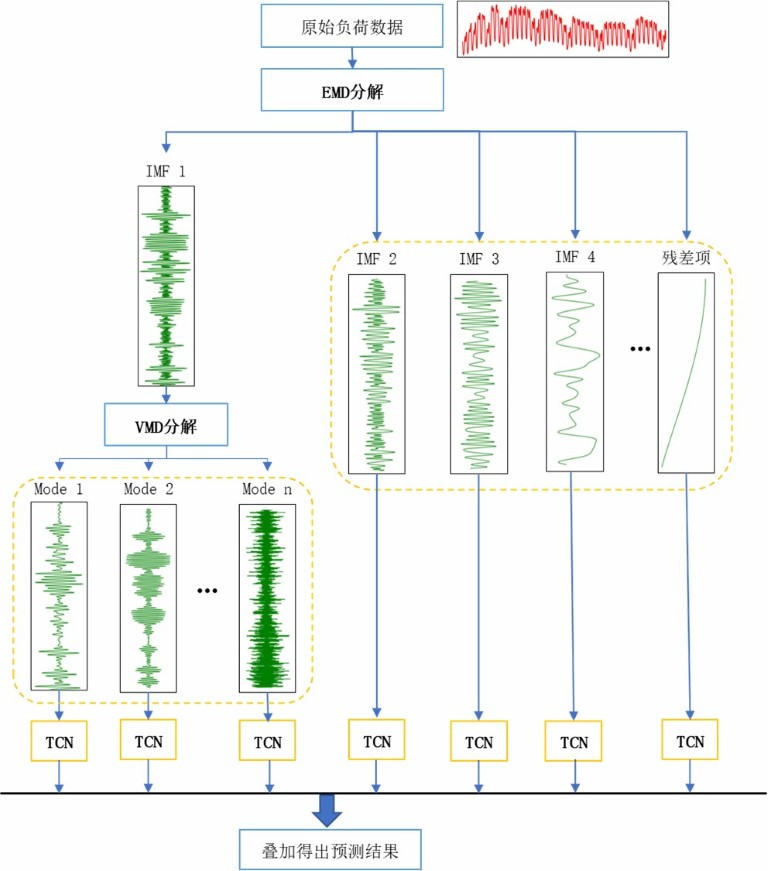
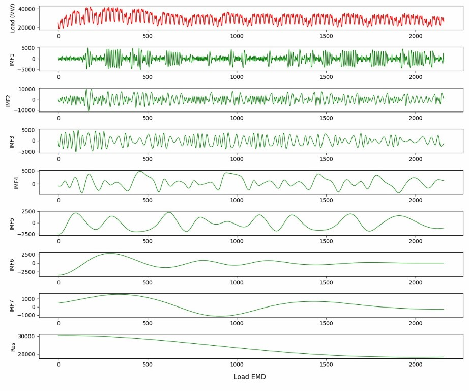
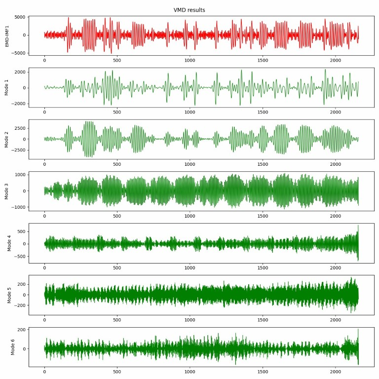
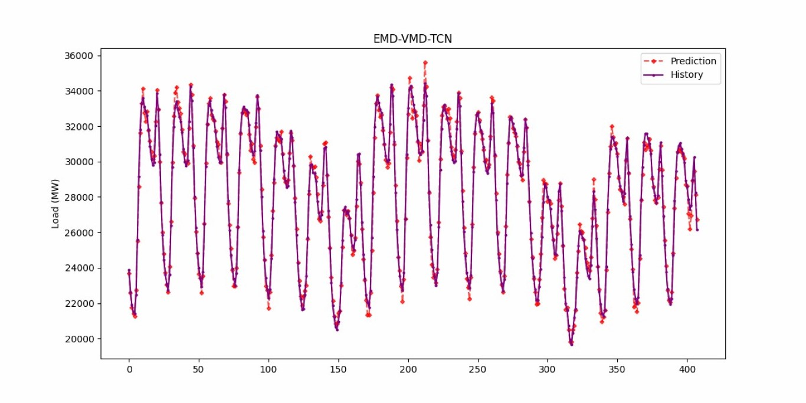

# 模型介绍

1. EMD 分解原始负荷，分解出来 IMF1~7 和一个残差。（注意数量级）
2. VMD 对 IMF1 再次进行分解，分解个数取 6。
3. 共 13 个序列，依次使用 TCN 进行预测，再合并。
   **模型：**
   
   **EMD 分解结果：**
   
   **VMD 分解结果：**
   

## TCN 模型参数

|   参数名    |       值        |
| :---------: | :-------------: |
|   filters   |       48        |
| kernel size |        3        |
|  dilations  | [1,2,4,8...2^6] |
|    stack    |        1        |
|   dropout   |        0        |
| weight norm |      True       |

## EMD-VMD-TCN 各序列预测误差

| 序列 | epoch |   MSE   |   RMSE   | MAPE % |    R2    |
| :--: | :---: | :-----: | :------: | :----: | :------: |
|  1   |  117  | 0.00015 | 0.01234  |  1.88  | 0.99074  |
|  2   |  111  | 0.00014 | 0.01169  |  1.96  | 0.99103  |
|  3   |  94   | 0.00012 | 0.01115  |  4.24  | 0.99726  |
|  4   |  86   | 0.00003 | 0.00553  |  0.73  | 0.99937  |
|  5   |  71   | 0.00001 | 0.00138  |  0.18  | 0.97598  |
|  6   |  80   | 0.00008 | 0.00876  |  2.38  |  0.9647  |
|  7   |  95   | 0.00001 | 0.00085  |   -    | 0.98211  |
|  8   |  135  | 0.00046 | 0.021427 | 4.591  | 0.98223  |
|  9   |  106  | 0.00032 | 0.01801  |  3.37  | 0.99056  |
|  10  |  131  | 0.00074 |  0.0271  |  6.07  | 0.987823 |
|  11  |  85   | 0.00202 | 0.044942 |   -    | 0.89923  |
|  12  |  106  | 0.00195 |  0.0441  |   -    | 0.95666  |
|  13  |  79   | 0.00098 | 0.03134  |   -    | 0.93849  |

序列 1-7 对应 EMD 分解的 IMF2-IMF7 和残差分量。8-13 对应 VMD 分解的子序列。
序列 7、11、12 和 13 中有真实值过于接近 0，计算 MAPE 时作为分母，所以导致 MAPE 呈现出几乎无穷大的异常，将其舍去。

**预测结果：**

RMSE: 360.09175372929633
MAPE: 0.00995690803815753
R2: 0.99085482908544
